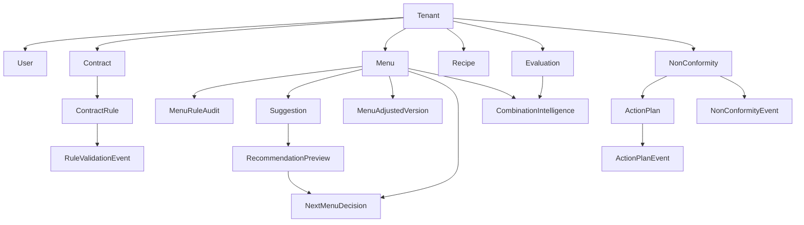

# MenuCare - Domain Model (Sprint A)

## Objetivo
Definir o modelo de dominio funcional do MenuCare para alinhar negocio, codigo e dados.

Escopo deste documento:
- bounded contexts
- entidades principais
- relacionamentos
- agregados raiz
- ownership (owner context, source of truth, regras)

## Fontes usadas
- docs/product-specification.md
- docs/escopo-funcional-completo.md
- docs/architecture-principles.md
- AGENTS.md
- apps/api/src/server.ts (rotas e entidades persistidas)

---

## 1. Bounded Contexts

### 1.1 Auth & Identity
Responsavel por autenticacao, sessao, convites de acesso e preferencias de idioma/perfil operacional.

Entidades principais:
- Tenant
- User
- FirstAccessInvite
- RefreshSession
- InviteAuditEvent
- LocalePreference
- OperationalProfile

### 1.2 Contracts
Responsavel por contratos e regras contratuais aprovadas.

Entidades principais:
- Contract
- ContractRule
- RuleValidationEvent

### 1.3 Menu Planning
Responsavel pela importacao/registro de cardapios, ciclo mensal e versoes ajustadas.

Entidades principais:
- MenuImport
- OperationalCardapio
- MonthlyCycleSummary
- CommemorativeDate
- MenuAdjustedVersion

### 1.4 Recipes
Responsavel pela base estruturada de receitas e classificacao.

Entidades principais:
- Recipe
- RecipeIngredient
- RecipeItemIngredient
- RecipeImportEvent
- RecipeClassificationEvent

### 1.5 Compliance
Responsavel por auditoria contratual e financeira de cardapios, nao conformidades e planos de acao.

Entidades principais:
- MenuRuleAudit
- Suggestion
- NonConformity
- ActionPlan
- NonConformityEvent
- ActionPlanEvent
- ComplianceExportEvent

### 1.6 Evaluations
Responsavel por importacao de avaliacoes e consolidacao de inteligencia de combinacoes.

Entidades principais:
- EvaluationImport
- CombinationIntelligence

### 1.7 Recommendations & Governance
Responsavel por politica de recomendacao, proposta de proximo cardapio e decisao auditada.

Entidades principais:
- RecommendationPreview (visao derivada)
- NextMenuDecision
- RecommendationPolicy (contrato de governanca)

### 1.8 AI Preparation (Support)
Responsavel por trilha de preparacao de dados para IA (apoio), sem decisao operacional.

Entidades principais:
- AIPreparationEvent

---

## 2. Entidades Centrais

Entidades centrais de negocio (linguagem ubíqua):
- Tenant
- User
- Contract
- ContractRule
- Menu
- Recipe
- Evaluation
- Audit
- Recommendation
- NonConformity
- ActionPlan

Representacao atual no backend (nomes observados):
- Tenant/User: schema Prisma base
- Contract: contracts
- ContractRule: extracted_rules
- Menu: menu_pdf_imports + menu_operational_cardapios
- Recipe: recipe_library_items
- Evaluation: menu_evaluation_imports
- Audit: menu_import_rule_audits + eventos
- Recommendation: menu_import_adjustment_suggestions + governanca de recomendacao
- NonConformity: non_conformities
- ActionPlan: non_conformity_action_plans

---

## 3. Relacionamentos de Alto Nivel

Relacoes criticas:
- Contract 1:N ContractRule
- ContractRule 1:N RuleValidationEvent
- Menu 1:N MenuRuleAudit
- Menu 1:N Suggestion
- Menu 1:N MenuAdjustedVersion
- Menu 1:N NextMenuDecision
- NonConformity 1:N ActionPlan
- NonConformity 1:N NonConformityEvent
- ActionPlan 1:N ActionPlanEvent
- Evaluation N:1 CombinationIntelligence (agregado por contexto de combinacao)

---

## 4. Agregados e Aggregate Roots

### 4.1 Tenant (aggregate root)
Entidades internas:
- User
- OperationalProfile
- LocalePreference

Regras:
- isolamento de dados por tenant
- tenant derivado da identidade autenticada

### 4.2 Contract (aggregate root)
Entidades internas:
- ContractRule
- RuleValidationEvent

Regras:
- regra sempre pertence a um contrato
- regra precisa de status
- transicao de status gera historico
- somente regras aprovadas alimentam conformidade

### 4.3 Menu (aggregate root)
Entidades internas:
- MenuRuleAudit
- Suggestion
- MenuAdjustedVersion
- NextMenuDecision

Regras:
- auditoria e sugestoes devem ter rastreabilidade
- versao ajustada deve registrar impacto
- aprovacao pode ser bloqueada apenas por criterios obrigatorios

### 4.4 RecipeLibrary (aggregate root)
Entidades internas:
- Recipe
- RecipeItemIngredient
- RecipeClassificationEvent

Regras:
- reclassificacao manual deve gerar evento
- classificacao estruturada e fonte primaria para auditoria

### 4.5 NonConformityCase (aggregate root)
Entidades internas:
- NonConformity
- ActionPlan
- NonConformityEvent
- ActionPlanEvent

Regras:
- mudanca de status deve gerar historico
- plano de acao pertence a uma nao conformidade

### 4.6 RecommendationGovernance (aggregate root)
Entidades internas:
- RecommendationPreview
- NextMenuDecision

Regras:
- historico de avaliacoes nao bloqueia aprovacao sozinho
- decisao final e humana e auditada

---

## 5. Ownership por Entidade

| Entidade | Owner Context | Source of Truth | Principais regras |
|---|---|---|---|
| Tenant | Auth & Identity | identidade autenticada + tabela de tenant | isolamento de dados por tenant |
| User | Auth & Identity | cadastro/autenticacao | pertence a tenant, perfil de acesso definido |
| FirstAccessInvite | Auth & Identity | fluxo de convite | token ativo/inativo, ativacao unica |
| RefreshSession | Auth & Identity | sessao de refresh | rotacao, expiracao, revogacao por device/limite |
| Contract | Contracts | Contracts module | possui status e owner |
| ContractRule | Contracts | Contracts module | pertence a contrato, possui status e evidencia |
| RuleValidationEvent | Contracts | Contracts module | transicao de status sempre auditada |
| MenuImport | Menu Planning | Menus module | custo vs meta e status financeiro |
| OperationalCardapio | Menu Planning | Menus module | registro operacional por unidade/servico/dia |
| MonthlyCycleSummary | Menu Planning | Menus module | consolidado mensal rastreavel |
| MenuRuleAudit | Compliance | Compliance module | resultado conforme/parcial/nao conforme por regra |
| Suggestion | Compliance | Compliance module | origem, motivo e impacto obrigatorios |
| MenuAdjustedVersion | Menu Planning | Menus module | aplicacao de sugestoes com impacto consolidado |
| Recipe | Recipes | Recipes module | classificacao estruturada como base |
| RecipeClassificationEvent | Recipes | Recipes module | reclassificacao manual auditada |
| EvaluationImport | Evaluations | Evaluations module | avaliacao por contexto operacional |
| CombinationIntelligence | Evaluations | Evaluations module | historico agregado por combinacao |
| NonConformity | Compliance | Compliance module | ciclo de status auditado |
| ActionPlan | Compliance | Compliance module | pertence a nao conformidade |
| NonConformityEvent | Compliance | Compliance module | trilha de alteracoes de NC |
| ActionPlanEvent | Compliance | Compliance module | trilha de alteracoes de acao |
| ComplianceExportEvent | Compliance/Governance | trilha de exportacao | qualquer exportacao relevante deve gerar evento |
| RecommendationPreview | Recommendations & Governance | Governance module (derivado) | combina criterios obrigatorios + historico nao bloqueante |
| NextMenuDecision | Recommendations & Governance | Governance module | aprovacao/reprovacao com justificativa e auditoria |
| AIPreparationEvent | AI Preparation | trilha de suporte | IA apenas apoio, nunca decisao final |

---

## 6. Regras transversais obrigatorias

1. Multi-tenant:
- toda entidade operacional deve carregar tenant_id (ou equivalente transitório)
- derivacao de tenant sempre via identidade autenticada

2. Auditoria:
- mudancas criticas devem registrar ator, instante e transicao

3. Explicabilidade:
- recomendacoes e auditorias devem indicar evidencia e origem

4. Determinismo operacional:
- conformidade e bloqueios executados por regras de codigo, nao por inferencia LLM

5. Governanca humana:
- decisoes finais de aprovacao/publicacao exigem usuario responsavel

---

## 7. Pontos de atencao para Sprint B

1. Nomenclatura de tenant:
- hoje coexistem `tenant_id` e `company_name` como escopo em partes diferentes

2. Persistencia de dominio:
- entidades operacionais estao em SQL runtime na API e nao completamente modeladas no Prisma

3. Acoplamento de contexto:
- Recommendations/Governance e Menus compartilham regras no mesmo modulo fisico atual

4. Proxima saida esperada:
- `docs/domain-gap-analysis.md` comparando dominio alvo vs schema Prisma vs implementacao atual
